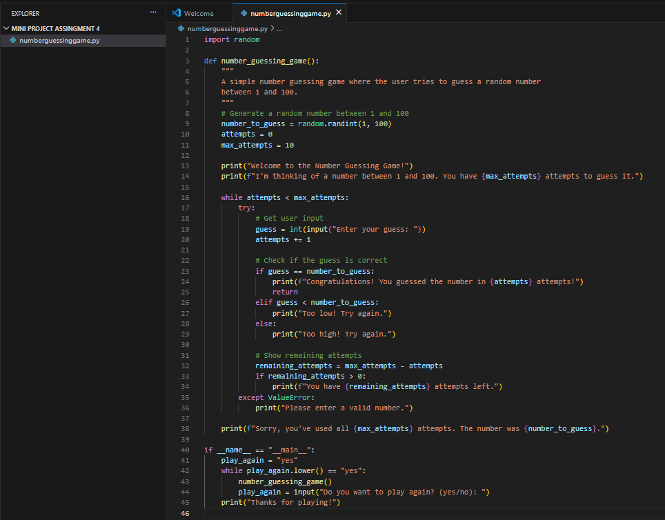

# Number Guessing Game

A simple command-line game where the computer picks a secret number, and you have to guess what it is!

## Screenshots



## Features

- The computer generates a random number between 1 and 100.
- The player has 10 attempts to guess the number.
- The game gives hints like "Too high!" or "Too low!".
- The game tells you if you win or lose.
- You can choose to play again after each game.

## How to Run

You only need Python 3 installed on your computer.

1.  Clone this repository to your computer:
    ```bash
    git clone https://github.com/VidhiGoyal083/number-guessing-game.git
    ```

2.  Go into the project folder:
    ```bash
    cd number-guessing-game
    ```

3.  Run the game:
    ```bash
    python game.py
    ```

## Author

[Vidhi Goyal]
